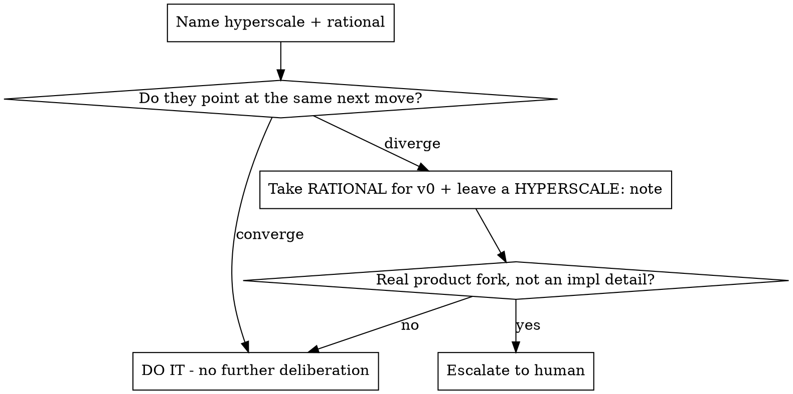

# Claude's Gamble: "Do the hyperscale and the rational approach converge?"

## Overview

A forced-juncture tiebreaker. When you must pick and you feel deliberation starting, name the two ends of the spectrum out loud and check whether they agree. **The bet:** most of the time the scaled-out ideal and the smallest sane path point at the *same* next move. When they do, there is nothing to deliberate. Just do it.

**Core principle:** Name the HYPERSCALE approach and the RATIONAL approach. If they CONVERGE, do that immediately. If they DIVERGE, that divergence is information. Take the rational path for v0 and flag the fork.

## When to use

- You're at a fork (which table, which abstraction, build-now vs defer, reuse vs new) and starting to weigh options.
- "We should build this for scale" is pulling against "ship the smallest working thing."
- You notice analysis creeping where a decision should be quick.
- A reviewer/plan adds scope and you're unsure whether to absorb it now.

**Not for:** genuine product forks that change what you're building (those belong to the human), or choices already settled by the plan/spec.

## The method

1. **Name HYPERSCALE**: the fully scaled, do-it-right-for-millions-of-users ideal. In a codebase this is often already written down, such as in `HYPERSCALE:` comments.
2. **Name RATIONAL**: the smallest correct thing that works for v0 right now.
3. **Check convergence:**

## Quick reference

| Situation | Hyperscale | Rational | Verdict |
|---|---|---|---|
| Where to store a task snapshot | dedicated snapshot service | reuse an existing task-state record | **Converge → reuse** (do it) |
| Cross-project reporting | centralized aggregation service | summarize each project separately | **Diverge → rational for v0**, leave a `HYPERSCALE:` note |
| Near-real-time notifications | always-on event worker | scheduled polling | **Diverge → rational**, escalate only if latency is a product requirement |

## Standing rules

1. **External-system reality is the tiebreaker for integrations.** When a fork
   models another system's behavior, "RATIONAL" means closest to that system's
   verified documentation or measured behavior, never implementation convenience.
   If neither candidate matches reality, stop and verify before resuming the
   gamble. Any deliberate approximation must be disclosed where users rely on it.
2. **The gamble exists so the human is NOT interrupted.** Resolving a fork and
   logging it (decision · why · how to reverse) IS the deliverable; asking the
   human mid-run is the failure mode. Batch what they would want to know into the
   ledger's human review queue for merge-ready. Only hard rails such as
   credentials, merge or PR actions, real spend, and irreversible changes escalate.

## Common mistakes

- **Deliberating after convergence.** The whole point: if both ends agree, the decision is already made. Stop and act.
- **Treating divergence as a stall.** Divergence is not "ask the human" by default. It is "rational for v0, flag the future." Only escalate a *real product fork*.
- **Skipping the naming step.** Saying "let's just do the simple thing" without naming the hyperscale alternative hides the cases where they genuinely diverge and the fork matters.
- **Using it to delete guardrails.** Convergence picks the *path*, never permission to drop a safety invariant.

## Relationship to neighbors

- **elon-first-principles** decides *whether a thing is required at all* (delete scope). Claude's Gamble decides *which way to build a thing you've already decided to build*.
- **first-principles** derives the correct answer from fundamentals when convention is misleading. Use it when you can't yet name a sane "rational" end.
- **karpathy** then measures that the chosen path actually works.
